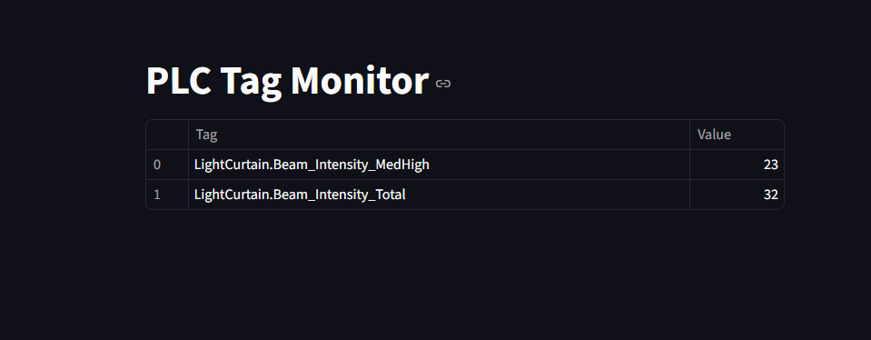

# pylogix_web_app
A simple example of reading tags from a Rockwell PLC using pylogix and displaying them on
a web page using streamlit.



## Setup
* Clone this repository ```git clone https://github.com/dmroeder/pylogix_web_app.git```
* Convert it to a virtual environment: ```python -m venv pylogix_web_app```
* Open PowerShell/Terminal in pylogix_web_app directory
* Activate venv ```./Scripts/activate```
* Install the requirements: ```pip install -r requirements.txt```
* Edit PLC_IP and TAGS variables in app.py
* Run the app: ```streamlit run app.py```

Streamlit should launch the web page for you, if not, you can navigate to http//:localhost:8501

You can stop streamlit with CTRL+C
